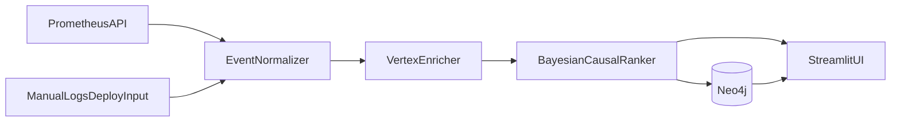

# OutageRoot

OutageRoot is an incident intelligence MVP that ingests Prometheus signals plus manual logs/deploy events, then builds a causal graph to rank likely root causes.

## Why this project

During incidents, teams often see correlation but not causality. OutageRoot focuses on:

- Building a graph of incident events across alerts, logs, and deploys
- Ranking likely cause chains with Bayesian-style scoring
- Producing actionable next checks in one view

## MVP Features

- Live Prometheus query ingestion (range and instant-style inputs)
- Manual log and deploy event ingestion
- Event normalization into a common schema
- Vertex-based semantic enrichment (with safe fallback heuristics)
- Neo4j-backed graph persistence and retrieval
- Ranked root-cause hypotheses with confidence
- Streamlit UI with causal table, graph snapshot, and exportable summary

## Architecture



## Quick Start

### 1) Create virtualenv and install dependencies

```bash
cd /home/mansoora/hustle/outageroot
python3 -m venv .venv
source .venv/bin/activate
pip install -r requirements.txt
```

### 2) Configure environment

```bash
cp .env.example .env
```

Update values in `.env` as needed, especially:

- `PROMETHEUS_BASE_URL`
- `NEO4J_URI`, `NEO4J_USER`, `NEO4J_PASSWORD`
- `GCP_PROJECT_ID`, `GCP_LOCATION`, `GCP_VERTEX_MODEL`

### 3) Start Neo4j

```bash
docker compose up -d
```

### 4) Run the app

```bash
source .venv/bin/activate
streamlit run app.py
```

## Input Formats

### Manual log input

Accepts common log lines, for example:

```text
2026-03-08T08:00:12Z service=checkout level=ERROR message="db timeout during checkout"
2026-03-08T08:00:20Z service=payments level=WARN message="retry budget exhausted"
```

### Manual deploy event input

Supports JSON array or pipe-delimited text.

JSON example:

```json
[
  {
    "timestamp": "2026-03-08T07:58:00Z",
    "service": "checkout",
    "version": "v142",
    "action": "deploy"
  }
]
```

Pipe-delimited example:

```text
2026-03-08T07:58:00Z|checkout|v142|deploy
```

## Testing

```bash
source .venv/bin/activate
pytest -q
```

## Demo Dataset

Sample data lives under `sample_data/incident_001/` for repeatable runs and screenshots.

## Local Demo Runbook

1. Start Neo4j:
   - `docker compose up -d`
2. Launch app:
   - `streamlit run app.py`
3. In the UI:
   - Set incident window
   - Paste `sample_data/incident_001/logs.txt` into Manual logs
   - Paste `sample_data/incident_001/deploy_events.json` into Manual deploy events
   - Paste each line from `sample_data/incident_001/prometheus_queries.txt` into query box
4. Click **Run OutageRoot Analysis**
5. Capture:
   - Top hypothesis card
   - Causal graph snapshot
   - Causal edge table

Suggested benchmark line for posting:

- "Initial triage often took 30-45 minutes; OutageRoot produced top hypotheses and causal links in under 30 seconds for the sample incident."

## Kind Real-Test Expansion

For richer, real-time demos with additional metric sources, use:

- `kind_lab/README.md`

This includes:

- add-on deployments (`pushgateway`, `node-exporter-lite`)
- Prometheus scrape config update script
- synthetic metric generator script for incident simulations
